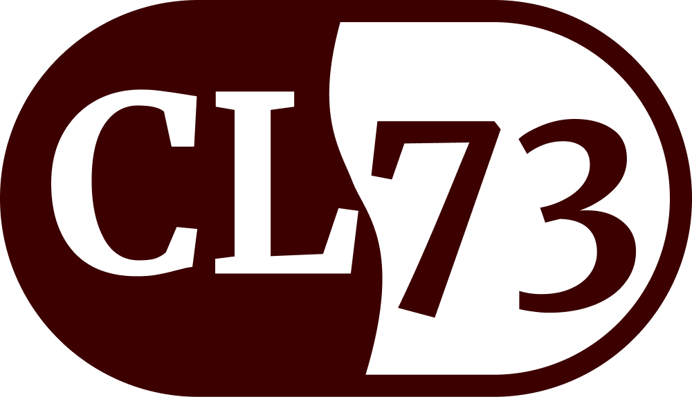

# Café Lima 73

## Introduction
**CL73** é um site estático desenvolvido no estilo de uma "página brochure" da cafeteria fictícia Café Lima 73. O design dela é completamente responsivo e permite a visualização em monitores grandes, tablets e dispositivos móveis.

A versão mais recente foi publicada usando GitHub Pages. Sinta-se à vontade para visitá-la e me dizer o que você achou! [Link](https://luisecl.github.io/CL73/)

## Tech Stack

 
  
  
  

 

- HTML
- CSS
- JavaScript

## Features
O projeto inclui:
- Carrossel que muda de imagens automáticamente
- Barra de navegação com scroll às diferentes seções da página
- Botão de 'Ler Mais' para exibir ou ocultar informações na seção Sobre Nós
- Tabela com botões para alternar entre informações segundo categoría
- Seção de comentários com scroll manual (visualação Mobile ou Tablet)
- Galeria de imagens com modal e botões de navegação
- Conexão com API da Google Maps (Atualmente não funcionando devido à chave usada não estar associada a uma conta paga)
